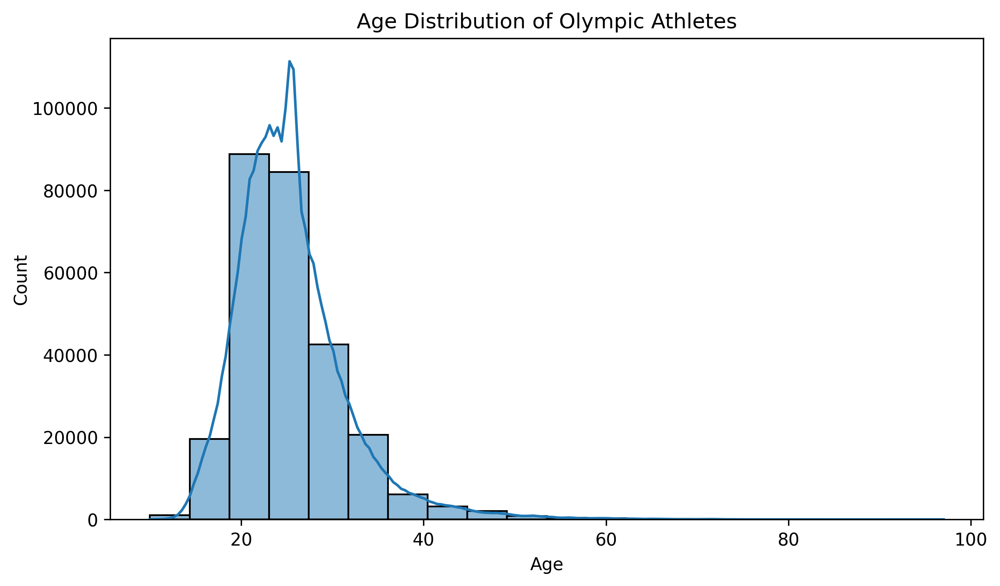
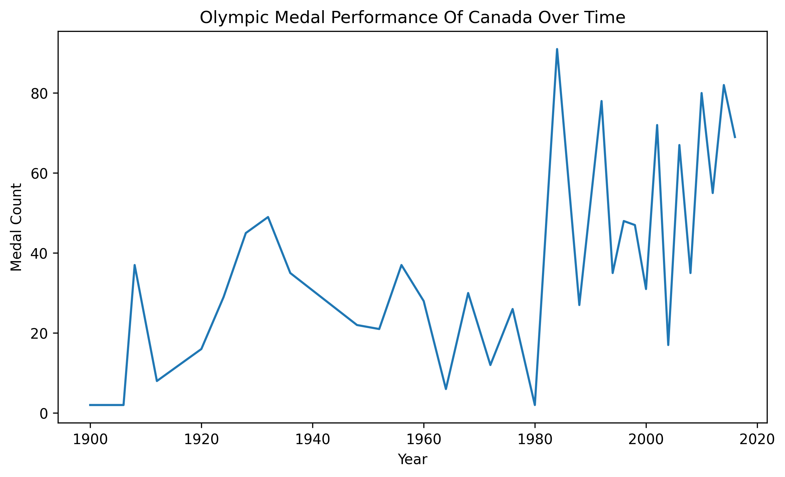

# 🏅 Olympic Data Analysis Project

[](https://www.python.org/)
[](https://pandas.pydata.org/)
[](https://matplotlib.org/)
[](https://seaborn.pydata.org/)
[](https://www.kaggle.com/)

## Overview

This project provides a comprehensive analysis of 120 years of Olympic history using data from Kaggle. The analysis covers athlete demographics, performance patterns, medal distributions, and historical trends across different Olympic events from 1896 to 2016.

## Dataset Information

The project uses the "120 Years of Olympic History: Athletes and Results" dataset from Kaggle, which contains:

- **athlete_events.csv**: Main dataset with 271,116 records and 15 columns
- **noc_regions.csv**: National Olympic Committee (NOC) to region mapping

### Dataset Features
- **Athlete Information**: ID, Name, Sex, Age, Height, Weight
- **Competition Details**: Team, NOC, Games, Year, Season, City, Sport, Event
- **Performance**: Medal (Gold, Silver, Bronze, or NaN for no medal)

## Project Structure

```
olympicdata_analysis/
├── data/
│   ├── athlete_events.csv
│   └── noc_regions.csv
├── plots/
│   ├── age_dist.png
│   ├── scatterplot.png
│   ├── boxplot.png
│   ├── line.png
│   └── top10.png
├── olympic.ipynb
├── requirements.txt
└── README.md
```

## Installation and Setup

### Prerequisites
- Python 3.12+
- pip package manager

### Installation Steps

1. **Clone the repository**
   ```bash
   git clone <repository-url>
   cd olympicdata_analysis
   ```

2. **Create and activate virtual environment**
   ```bash
   python -m venv olympic
   source olympic/bin/activate  # On Windows: olympic\Scripts\activate
   ```

3. **Install dependencies**
   ```bash
   pip install -r requirements.txt
   ```

4. **Kaggle API Setup**
   - Create a Kaggle account and download your API credentials
   - Place `kaggle.json` in `~/.kaggle/` directory
   - Set appropriate permissions: `chmod 600 ~/.kaggle/kaggle.json`

## Data Pipeline

### 1. Data Acquisition
The project automatically downloads the Olympic dataset using the Kaggle API:

```python
import kaggle
kaggle.api.authenticate()
kaggle.api.dataset_download_files('heesoo37/120-years-of-olympic-history-athletes-and-results', 
                                 path='data', unzip=True)
```

### 2. Data Loading and Preprocessing
- Load the dataset using pandas
- Handle missing values in Age, Height, and Weight columns using mean imputation
- Remove duplicate records
- Perform exploratory data analysis

### 3. Data Quality Assessment
- **Dataset Size**: 271,116 rows × 15 columns
- **Missing Values**: Handled for Age, Height, and Weight
- **Duplicates**: Removed to ensure data integrity
- **Data Types**: Properly categorized (numerical vs categorical)

## 📊 Analysis and Visualizations

---

### 📈 1. Age Distribution of Olympic Athletes (1896-2016)



**Key Findings:**
- The age distribution shows a right-skewed pattern
- Most athletes compete in their 20s, indicating peak athletic performance age
- The distribution reflects the natural aging process and retirement patterns in sports

### 📏 2. Height vs Age Relationship by Gender Across Olympic History


**Key Findings:**
- **General Trend**: There's a visible trend of increasing height with age during the younger years (roughly up to 20-25), after which height appears to stabilize and then potentially slightly decrease or remain constant in older ages.

- **Sex Differences**:
  - Males (blue dots) generally appear to be taller than females (orange dots) across most age groups, especially after reaching adult height
  - The spread of heights for males seems to extend to higher values than for females

- **Age Distribution**: There appears to be a higher density of data points in the younger and middle age ranges (e.g., 20-60 years old) compared to very young or very old ages

- **Variability**: There's a considerable amount of variability in height within each age group for both sexes

---

### 🏆 3. Medal Performance Distribution by Age and Gender


**Key Findings:**
- Reveals that for all medal types, age groups of 20-30 receive the majority of all medals
- This pattern applies to both males and females
- The optimal performance age window is clearly defined across different medal categories

### 🇨🇦 4. Canada's Olympic Medal Performance Over Time (1896-2016)



**Key Findings:**
- Shows an increase with lowest performance in the 1900s
- Peak medals achieved around the 1980s
- Notable drop in performance in 2020
- Demonstrates the evolution of Canada's Olympic success over a century

---

### 👑 5. Top 10 Most Decorated Olympic Athletes in History


**Key Findings:**
- Identifies the most successful Olympic athletes in history
- Shows the distribution of medal counts among top performers
- Provides insights into exceptional athletic achievements

## Statistical Insights

### Correlation Analysis
- Analyzed relationships between numerical variables (Age, Height, Weight)
- Generated correlation heatmaps to identify significant relationships

### Gender Distribution
- Analyzed participation patterns by gender across Olympic history
- Identified trends in gender representation over time

### Sport Popularity
- Ranked sports by participation levels
- Created visualizations showing the most popular Olympic sports

## Technical Implementation

### Libraries Used
- **pandas**: Data manipulation and analysis
- **numpy**: Numerical computations
- **matplotlib**: Basic plotting
- **seaborn**: Advanced statistical visualizations
- **kaggle**: API for dataset download

### Data Processing Techniques
- **Missing Value Imputation**: Used mean values for Age, Height, and Weight
- **Duplicate Removal**: Ensured data quality by removing duplicate records
- **Data Type Optimization**: Proper categorization of numerical and categorical variables

## Key Insights Summary

1. **Optimal Performance Age**: Athletes in their 20s dominate Olympic competitions
2. **Gender Differences**: Clear patterns in height and performance by gender
3. **Historical Trends**: Canada's Olympic success shows distinct periods of achievement
4. **Physical Attributes**: Height and age show predictable relationships across gender groups
5. **Elite Performance**: Top athletes demonstrate exceptional medal-winning capabilities

## Future Enhancements

Potential areas for further analysis:
- Geographic analysis of Olympic success by country
- Seasonal analysis (Summer vs Winter Olympics)
- Sport-specific performance patterns
- Economic factors correlation with Olympic success
- Machine learning models for performance prediction

## Contributing

Feel free to contribute to this project by:
- Adding new visualizations
- Implementing additional statistical analyses
- Improving data preprocessing techniques
- Adding new features or insights

## License

This project is open source and available under the MIT License.

## Contact

For questions or suggestions about this analysis, please open an issue in the repository.
